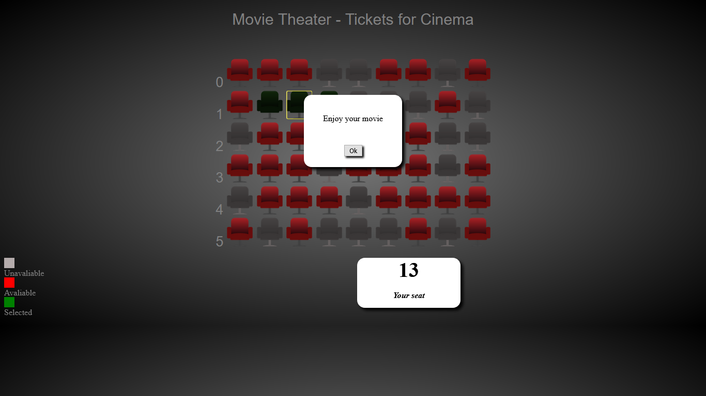

# Movie Theater - Tickets para cinema

 => Praticando JavaScript em exercício baseado no livro "Use a Cabeça - JavaScript"

​		Influenciado na idéia do exercício  <a href="https://github.com/ju-c-lopes/Mandango-Tickets-Cinema" target="_blank">Mandango, do livro "Use a cabeça"</a>

, refiz esse exercício a minha maneira, utilizando algumas idéias do exercício original, porém dando a minha personalização e funcionalidades diferentes ao original

